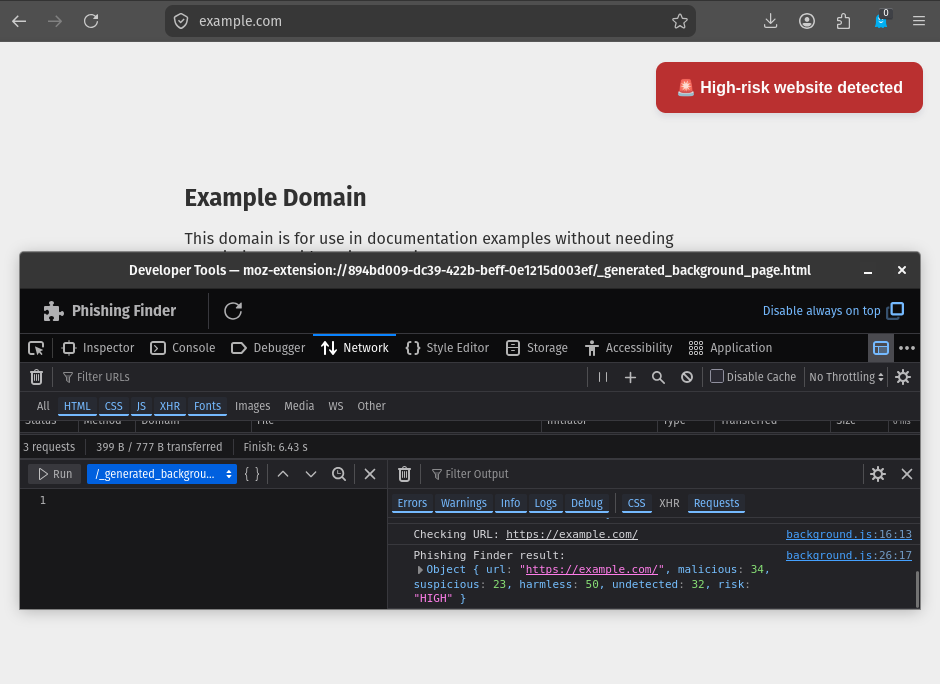
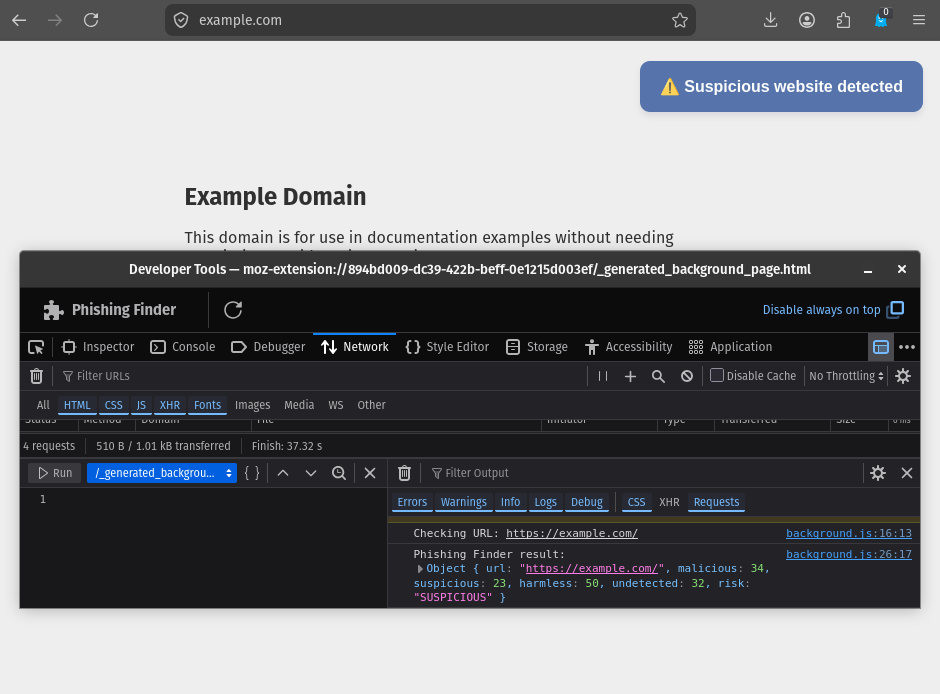
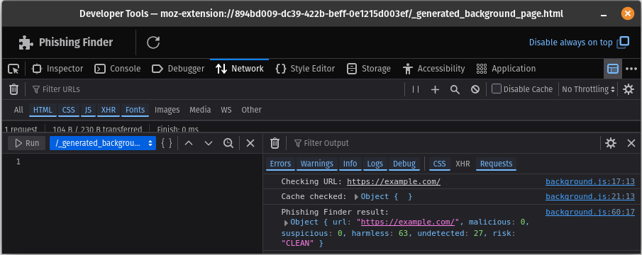
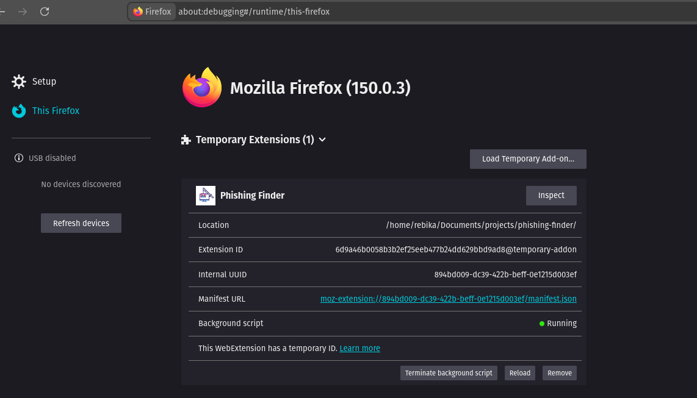

# Phishing Finder

A Firefox browser extension that detects potentially malicious and suspicious URLs using the VirusTotal API.

Phishing Finder monitors the URLs visited by the user, sends the exact URL to a local FastAPI backend for analysis, and uses VirusTotal security intelligence to determine the risk associated with the URL.

The extension is designed to notify the user **only when a potentially suspicious or high-risk URL is detected**.

---

## Screenshots

### Phishing Warning





### Inspect Element



### Firefox Extension



## Features

- Scans the exact full URL visited by the user
- Uses VirusTotal for URL security analysis
- Detects `SUSPICIOUS` and `HIGH` risk URLs
- Displays an in-page warning for potentially dangerous URLs
- Does not display warnings for clean URLs
- Caches previously scanned results using Firefox `storage.local`
- Prevents duplicate scans of the same URL
- Does not cache `UNKNOWN` results
- Keeps the VirusTotal API key on the backend instead of exposing it in the extension
- Handles backend and API errors
- Uses a FastAPI backend to separate browser functionality from external API communication

---

# How It Works

Phishing Finder consists of three main components:

1. Firefox WebExtension
2. FastAPI backend
3. VirusTotal API

```text
┌──────────────────────┐
│       Firefox        │
│       Browser        │
└──────────┬───────────┘
           │
           │ Exact URL
           ▼
┌──────────────────────┐
│  Firefox Extension   │
│                      │
│  background.js       │
│  content.js          │
└──────────┬───────────┘
           │
           │ HTTP request
           ▼
┌──────────────────────┐
│    FastAPI Backend   │
│                      │
│      server.py       │
└──────────┬───────────┘
           │
           │ VirusTotal API
           ▼
┌──────────────────────┐
│      VirusTotal      │
│                      │
│   URL Analysis       │
│   Threat Intelligence│
└──────────┬───────────┘
           │
           │ Result
           ▼
┌──────────────────────┐
│   Firefox Extension  │
└──────────┬───────────┘
           │
           ▼
   SUSPICIOUS / HIGH?
        /       \
      YES        NO
       │          │
       ▼          ▼
    Warning    No warning
```

---

# Detection Flow

## 1. Detect a completed page load

The extension listens for completed tab updates using Firefox's tabs API.

When a page finishes loading, the extension obtains the complete URL.

Example:

```text
https://login.example.com/account/reset?token=123
```

The extension uses the **full URL** instead of reducing it to only the apex domain.

This allows the backend and VirusTotal to analyze the specific URL that the user visited.

---

## 2. Check the local cache

Before sending a request to the backend, the extension checks Firefox's local storage.

```javascript
const cached = await browser.storage.local.get(fullURL);
```

If the URL already has a stored result, the extension uses that result instead of sending another request.

```text
             URL
              │
              ▼
         Check cache
          /       \
        Found    Not found
          │          │
          ▼          ▼
    Use result    Scan URL
```

This reduces unnecessary requests to VirusTotal.

---

## 3. Prevent duplicate scans

Firefox can generate multiple tab update events.

To prevent multiple simultaneous scans of the same URL, the extension maintains a `Set`:

```javascript
const scanningURLs = new Set();
```

Before scanning:

```javascript
if (scanningURLs.has(fullURL)) {
  return;
}
```

The URL is then added to the set while the scan is running.

After the scan finishes, it is removed:

```javascript
scanningURLs.delete(fullURL);
```

---

## 4. Send the URL to the backend

If the URL is not already cached, the extension sends it to the FastAPI backend.

The current development backend runs at:

```text
http://127.0.0.1:8000
```

The endpoint used by the extension is:

```text
/check
```

The complete URL is URL-encoded before being sent.

---

## 5. FastAPI communicates with VirusTotal

The backend receives the URL and communicates with the VirusTotal API.

The VirusTotal API key is stored in the backend environment rather than inside the Firefox extension.

This is important because extension source code can be inspected by users.

The backend returns a simplified result to the extension.

Example:

```json
{
  "url": "https://example.com/",
  "malicious": 0,
  "suspicious": 0,
  "harmless": 64,
  "undetected": 26,
  "risk": "CLEAN"
}
```

---

## 6. Determine the risk

Phishing Finder currently uses four risk states:

| Risk         | Behavior                            |
| ------------ | ----------------------------------- |
| `CLEAN`      | No warning                          |
| `SUSPICIOUS` | Warning displayed                   |
| `HIGH`       | Warning displayed                   |
| `UNKNOWN`    | No warning and result is not cached |

The extension only sends the warning message when:

```javascript
result.risk === "SUSPICIOUS";
```

or:

```javascript
result.risk === "HIGH";
```

Clean results do not generate an in-page warning.

---

# Caching

Phishing Finder uses Firefox's `storage.local` API to store scan results.

A cached entry contains the result and the time it was stored:

```javascript
const cacheEntry = {
  result: result,
  timestamp: Date.now(),
};
```

The current implementation does not yet automatically expire cached results.

The `timestamp` is stored so that cache expiration can be implemented in a future version.

### Why caching is important

The VirusTotal Public API has request limits.

Without caching:

```text
Visit website
      ↓
VirusTotal request

Visit again
      ↓
Another VirusTotal request

Visit again
      ↓
Another VirusTotal request
```

With caching:

```text
First visit
     ↓
VirusTotal request
     ↓
Save result
     ↓
Cache

Later visit
     ↓
Use cached result
```

This reduces unnecessary API requests.

---

# VirusTotal API Limitations

Phishing Finder currently uses the **VirusTotal Public API**.

According to VirusTotal's documentation, the Public API is limited to:

- **4 requests per minute**
- **500 requests per day**

The Public API is also intended for non-commercial use and is not intended to replace antivirus or other security products.

See the official VirusTotal documentation for the current API restrictions and terms:

https://docs.virustotal.com/reference/public-vs-premium-api

These limitations are especially important for a browser extension because normal browsing can generate many URL checks.

The project's caching system is therefore an important part of the architecture.

> API limits and terms may change. Always check the current VirusTotal documentation before deploying the project or increasing its usage.

---

# Project Structure

```text
phishing-finder/
│
├── images/
│   ├── High-risk.png
│   ├── inspect.png
│   └── Suspicious-risk.png
│
├── background.js
├── content.js
├── manifest.json
├── server.py
├── test_vt.py
├── requirements.txt
├── icon.svg
├── .gitignore
├── .example.env
└── README.md
```

### `manifest.json`

Defines the Firefox extension configuration, permissions, scripts, and metadata.

### `background.js`

Responsible for:

- Detecting completed page loads
- Obtaining the current URL
- Checking the local cache
- Preventing duplicate scans
- Communicating with the FastAPI backend
- Processing risk results
- Sending warning messages to the content script

### `content.js`

Responsible for displaying the phishing warning directly on the webpage.

### `server.py`

The FastAPI backend responsible for communicating with VirusTotal.

The VirusTotal API key is loaded by the backend and is not included in the browser extension.

### `test_vt.py`

A standalone script for testing VirusTotal API communication.

### `requirements.txt`

Contains the Python dependencies required by the backend.

Current dependencies:

```text
fastapi
uvicorn
requests
python-dotenv
```

### `icon.svg`

The Firefox extension icon.

### `.gitignore`

Prevents sensitive and unnecessary files from being committed to the repository.

The `.env` file should be ignored because it contains the VirusTotal API key.

### `.example.env`

Simply rename the file as .env and replace with your VirusTotal API key.

---

# Requirements

Before running Phishing Finder, you need:

- Firefox
- Python 3
- A VirusTotal account
- A VirusTotal API key
- Internet connection

---

# Installation

## 1. Clone the repository

```bash
git clone <YOUR-GITHUB-REPOSITORY-URL>
cd phishing-finder
```

---

## 2. Create a virtual environment

### Linux/macOS

```bash
python3 -m venv .venv
```

Activate it:

```bash
source .venv/bin/activate
```

### Windows

```powershell
python -m venv .venv
```

Activate it:

```powershell
.venv\Scripts\activate
```

---

## 3. Install dependencies

Install the backend dependencies from `requirements.txt`:

```bash
pip install -r requirements.txt
```

---

## 4. Configure the VirusTotal API key

Create a `.env` file in the project directory:

```text
VIRUSTOTAL_API_KEY=your_api_key_here
```

Do not commit this file to GitHub. You may simply rename .example.env file instead.

Your `.gitignore` should contain:

```gitignore
.env
.venv/
venv/
__pycache__/
*.pyc
```

---

# Running the Backend

Start the FastAPI backend:

```bash
uvicorn server:app --host 127.0.0.1 --port 8000
```

The backend should now be available at:

```text
http://127.0.0.1:8000
```

FastAPI provides interactive API documentation at:

```text
http://127.0.0.1:8000/docs
```

The `/docs` page can be used to test the backend independently from the Firefox extension.

---

# Installing the Firefox Extension

The current project can be loaded into Firefox as a temporary extension for development and testing.

## 1. Open Firefox debugging

Enter:

```text
about:debugging
```

in the Firefox address bar.

## 2. Select This Firefox

Choose:

**This Firefox**

## 3. Load the extension

Click:

**Load Temporary Add-on...**

Navigate to the cloned project directory and select:

```text
manifest.json
```

Firefox will load the extension.

## 4. Start browsing

With the FastAPI backend running, visit websites normally.

The extension will automatically process completed page loads.

Temporary Firefox extensions are primarily intended for development and testing. For normal end-user distribution, the extension should be packaged and submitted through Mozilla's add-on publishing process.

---

# Usage

Once the backend and extension are running:

```text
Start FastAPI
      ↓
Load extension in Firefox
      ↓
Visit a website
      ↓
Extension obtains full URL
      ↓
Check local cache
      ↓
Cached?
   /       \
 YES       NO
  │         │
  │         ▼
  │     FastAPI backend
  │         │
  │         ▼
  │     VirusTotal
  │         │
  │         ▼
  │      Result
  │         │
  │         ▼
  │       Cache
  │         │
  └────┬────┘
       ↓
Check risk
       ↓
SUSPICIOUS / HIGH?
    /          \
  YES           NO
   │             │
   ▼             ▼
Warning       Nothing
```

---

# Example Console Output

When scanning a new URL:

```text
Checking URL: https://example.com/
Cache checked: Object {}
Phishing Finder result: ...
Result cached for URL: https://example.com/
```

When the URL has already been scanned:

```text
Checking URL: https://example.com/
Cache checked: ...
Using cached result: ...
```

For a suspicious or high-risk URL, the extension sends:

```text
PHISHING_DETECTED
```

to the content script, which displays the warning to the user.

---

# Security Considerations

## API Key Protection

The VirusTotal API key must remain on the backend.

It should never be placed directly inside:

```text
background.js
content.js
manifest.json
```

Instead, it is loaded from:

```text
.env
```

The `.env` file must be included in `.gitignore`.

---

## Local Backend

The current development version communicates with:

```text
127.0.0.1:8000
```

This means the FastAPI server must be running on the same computer as the Firefox extension.

This architecture is suitable for development and testing.

It is not the final architecture for distributing the extension to general users because every user would otherwise need to:

1. Install Python
2. Install the project dependencies
3. Configure a VirusTotal API key
4. Run the FastAPI server

A future production architecture would use a properly deployed backend.

---

# Current Limitations

Phishing Finder is currently a development and educational security project.

Known limitations include:

- The FastAPI backend currently runs locally.
- Users must configure their own VirusTotal API key.
- The VirusTotal Public API has strict request limits.
- The extension relies on VirusTotal's available URL reputation and threat intelligence.
- A `CLEAN` result does not guarantee that a website is completely safe.
- A `UNKNOWN` result does not mean that a website is malicious.
- The extension currently warns after the page has loaded rather than functioning as a complete network-level blocking system.
- Cached results currently do not have automatic expiration.
- The extension currently supports Firefox.

---

# Future Improvements

Planned or possible improvements include:

- Deploy the FastAPI backend to a secure hosted server
- Implement automatic cache expiration
- Improve the warning interface
- Add a detailed URL analysis page
- Display individual security-vendor results
- Add manual URL scanning
- Add extension settings
- Add scan history
- Add backend rate limiting
- Improve handling when the backend is unavailable
- Combine VirusTotal results with local URL heuristics
- Improve false-positive and false-negative handling
- Add automated testing
- Package and publish the extension through Mozilla Add-ons

---

# Production Architecture

The current development architecture is:

```text
Firefox
   │
   ▼
Extension
   │
   ▼
Local FastAPI
   │
   ▼
VirusTotal
```

A future production architecture could be:

```text
Firefox
   │
   ▼
Extension
   │
 HTTPS
   ▼
Hosted FastAPI Backend
   │
   ▼
VirusTotal API
```

This would allow users to install the extension without running a local Python server.

A production deployment would also require appropriate authentication, rate limiting, API-key protection, logging, monitoring, and consideration of VirusTotal's API terms and usage limits.

---

# Development

During development, Firefox provides debugging tools for WebExtensions.

The extension can be inspected through:

```text
about:debugging
```

The background script can be inspected to view:

- URL detection
- Cache operations
- Backend requests
- VirusTotal results
- Warning messages
- Errors

After modifying extension files, reload the temporary extension before testing the changes.

---

# Contributing

Contributions, suggestions, and improvements are welcome.

If you find a bug:

1. Check whether it can be reproduced.
2. Open an issue describing the problem.
3. Include relevant console output where appropriate.
4. Do not include API keys, credentials, or other sensitive information.

For code contributions:

1. Fork the repository.
2. Create a feature branch.
3. Make your changes.
4. Test the extension and backend.
5. Submit a pull request.

---

# Disclaimer

Phishing Finder is an educational and security research project.

Detection results are based on information provided by VirusTotal and the project's own processing logic. A result should not be considered an absolute guarantee that a website is safe or malicious.

Users should continue to exercise caution when:

- Entering passwords
- Providing financial information
- Downloading files
- Opening links from unknown sources
- Providing sensitive information to websites

VirusTotal's Public API is not intended to replace antivirus or other security products.

---

# Author

GitHub: `https://github.com/apple-pie-h/`

---

# Acknowledgements

- [VirusTotal](https://www.virustotal.com/) — URL threat intelligence and security analysis
- [FastAPI](https://fastapi.tiangolo.com/) — backend API framework
- [Mozilla WebExtensions](https://developer.mozilla.org/en-US/docs/Mozilla/Add-ons/WebExtensions) — Firefox extension platform
